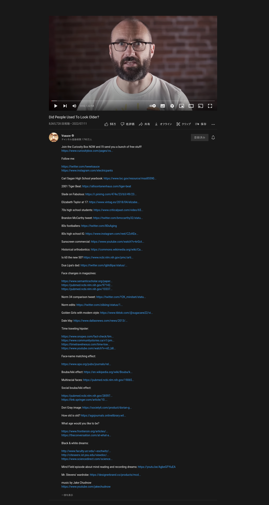

## userscripts
### yt-extract.js
insere os diálogos de um video de youtube no clipboard do sistema. util pra apredizagem de linguas.

qualquer coisa no seu clipboard será perdido.

### spotify-album-border.js
remove o border-radius dos albuns da biblioteca do spotify versão web

### simple-yt.js
tentativa em remover todas as distrações do youtube. não funcionando por enquanto.

foto

